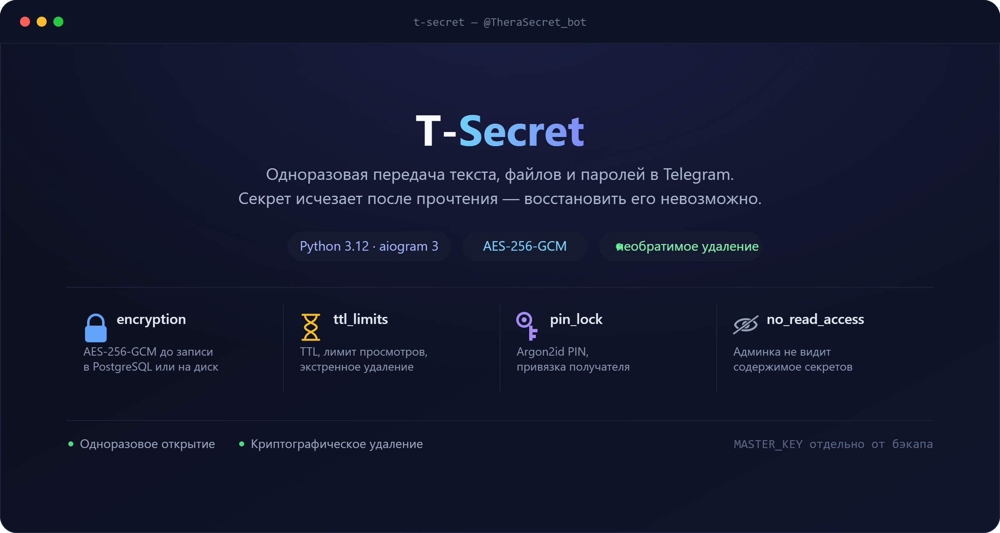
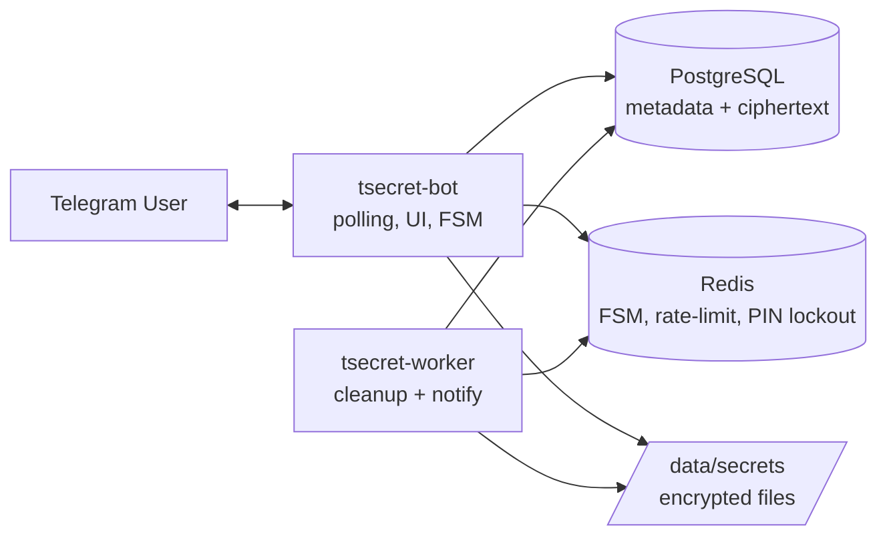

<p align="center">
  
</p>

# 🔒 T-Secret

**Self-hosted Telegram-бот для одноразовой передачи секретов** — текстов, паролей, файлов и токенов. Полный аналог OneTimeSecret / Privnote, живущий у вас на сервере: без сторонних сервисов, со сквозным шифрованием и криптографически необратимым удалением после прочтения.

<p align="left">
  
  
  
  
</p>

---

## Содержание

- [Возможности](#-возможности)
- [Гарантии безопасности](#-гарантии-безопасности)
- [Архитектура](#-архитектура)
- [Быстрый старт](#-быстрый-старт)
- [Переменные окружения](#-переменные-окружения)
- [Использование](#-использование)
- [Администрирование](#-администрирование)
- [Backup и MASTER_KEY](#-backup-и-master_key)
- [Разработка и тесты](#-разработка-и-тесты)
- [Структура проекта](#-структура-проекта)
- [Responsible disclosure](#-responsible-disclosure)
- [Лицензия](#-лицензия)

---

## ✨ Возможности

**Создание секрета**
- 📝 Произвольный текст или 📎 файл (до `MAX_SECRET_FILE_SIZE_MB`, шифруется отдельно от metadata).
- Настраиваемый TTL: от 5 минут до 7 дней или «до открытия».
- Лимит просмотров: 1 / 2 / 3 / 5 раз — секрет уничтожается по любому из условий первым.
- Защита PIN-кодом (4–6 знаков, с лимитом попыток и временной блокировкой).
- Привязка к конкретному Telegram-получателю — секрет открывается только указанным ID.
- Уведомления отправителю о факте открытия секрета.
- Таймер принудительного уничтожения независимо от факта прочтения.

**Генератор**
- 🎲 Пароли произвольной длины и алфавита (верхний/нижний регистр, цифры, спецсимволы) с оценкой энтропии в битах.
- Одноразовые PIN, API-токены (`secrets.token_urlsafe`), UUID — сразу с опцией «превратить в секрет».

**Secret Request**
- 📥 Один пользователь может запросить секрет у другого: бот создаёт ссылку-приглашение, получатель заполняет секрет в ответ, отправитель не должен ничего создавать вручную заранее.

**Управление своими секретами**
- 📂 Список активных секретов и история.
- 🚨 Экстренное удаление одного или сразу всех активных секретов («panic button»).

**Админ-панель** (`/admin`, только для `ADMIN_IDS`)
- Агрегированная статистика по секретам и пользователям.
- Просмотр пользователей и модерация.
- Мониторинг компонентов (Postgres, Redis, worker heartbeat).
- Metadata-only audit log — без единого поля, куда мог бы попасть plaintext, пароль, PIN или ключ.
- Кастомизация premium-эмодзи интерфейса.

---

## 🛡 Гарантии безопасности

- Содержимое (текст/файл) шифруется **AES-256-GCM** до записи в PostgreSQL или на диск (`/data/secrets`); ключ шифрования (`MASTER_KEY`) не хранится в базе.
- PIN хранится только как **Argon2id**-хэш, параметры (`time_cost`, `memory_cost`, `parallelism`) настраиваются через окружение.
- Публичный access-токен ищется по SHA-256; человекочитаемая копия токена восстанавливаема только через шифрование мастер-ключом.
- Одноразовое открытие сериализуется через `SELECT ... FOR UPDATE` в PostgreSQL — гонка двух одновременных открытий невозможна.
- Уничтожение секрета удаляет ciphertext, nonce, PIN-хэш, зашифрованное имя файла и данные привязки получателя. В базе остаётся только безопасная metadata (id, таймстемпы, статус).
- Админ-панель физически не содержит запросов или UI, способных прочитать содержимое секрета.
- Audit-лог принимает только заранее разрешённый набор metadata-полей — там нет схемы даже для plaintext, PIN, пароля или ключа.
- Rate-limiting на каждое чувствительное действие (`/start`, создание, открытие, запрос, загрузка файла) через Redis, с anti-bruteforce на PIN.

> ⚠️ Telegram уже получил исходное сообщение до того, как бот его удалил. T-Secret не может гарантировать удаление данных из инфраструктуры Telegram или с устройства отправителя/получателя — модель угроз ограничена собственной инфраструктурой бота.

Подробности и порядок сообщения об уязвимостях — в [SECURITY.md](SECURITY.md).

---

## 🏗 Архитектура



| Сервис | Роль |
|---|---|
| `tsecret-bot` | Telegram long polling, весь пользовательский интерфейс и FSM |
| `tsecret-worker` | Фоновое уничтожение истёкших/просмотренных секретов, уведомления, heartbeat |
| `tsecret-postgres` | Metadata и encrypted payload (`postgres:16-alpine`) |
| `tsecret-redis` | FSM-хранилище aiogram, anti-bruteforce, rate limits (`redis:7-alpine`) |

`postgres` и `redis` не публикуют порты наружу — доступны только внутри `internal`-сети docker compose.

---

## 🚀 Быстрый старт

Требования: Docker + Docker Compose plugin, Telegram-бот, полученный от [@BotFather](https://t.me/BotFather).

```bash
git clone https://github.com/<your-username>/t-secret.git
cd t-secret

cp .env.example .env

# сгенерировать MASTER_KEY (32 байта, urlsafe base64)
python3 -c "import base64,secrets; print(base64.urlsafe_b64encode(secrets.token_bytes(32)).decode())"

# впишите в .env: BOT_TOKEN, MASTER_KEY, POSTGRES_PASSWORD, ADMIN_IDS
${EDITOR:-nano} .env

docker compose up -d --build
docker compose logs -f tsecret-bot
```

После старта откройте бота в Telegram и отправьте `/start`.

**Обязательно заполнить в `.env`:**

| Переменная | Назначение |
|---|---|
| `BOT_TOKEN` | Токен бота от BotFather |
| `MASTER_KEY` | 32-байтный urlsafe-base64 ключ шифрования (команда выше) |
| `POSTGRES_PASSWORD` | Пароль для встроенного PostgreSQL |
| `DATABASE_URL` | Обычно `postgresql+asyncpg://tsecret:<пароль>@postgres:5432/tsecret` |
| `ADMIN_IDS` | Telegram ID администраторов через запятую |
| `TELEGRAM_PROXY` | Опционально: `socks5://host:port`, если Telegram API недоступен напрямую |

### Офлайн-установка (сервер без доступа к PyPI)

Образ собирается из локальных wheel-файлов в [`vendor/`](vendor) без обращения к сети:

```dockerfile
RUN pip install --no-cache-dir --no-index --find-links=/app/vendor -r requirements.txt
```

Если версии зависимостей меняются, обновите `vendor/` заранее (`pip download -r requirements.txt -d vendor/` на машине с доступом в интернет) — иначе просто удалите `vendor/` и уберите флаги `--no-index --find-links` из `Dockerfile`, чтобы ставить пакеты напрямую с PyPI.

---

## ⚙️ Переменные окружения

Полный список — в [`.env.example`](.env.example). Наиболее важные группы:

<details>
<summary>Показать таблицу переменных</summary>

| Переменная | По умолчанию | Описание |
|---|---|---|
| `BOT_TOKEN` | — | Токен Telegram-бота |
| `BOT_USERNAME` | `TSecretBot` | Имя бота, используется для генерации ссылок |
| `DATABASE_URL` | — | DSN для asyncpg/SQLAlchemy |
| `REDIS_URL` | — | DSN для Redis |
| `MASTER_KEY` | — | Ключ AES-256-GCM (32 байта, base64 urlsafe) |
| `TELEGRAM_PROXY` | — | SOCKS5-прокси для Telegram API (опционально) |
| `SECRET_MESSAGE_TTL` | `60` | Время жизни служебных сообщений бота, сек |
| `CLEANUP_INTERVAL` | `60` | Периодичность прохода worker'а по истёкшим секретам, сек |
| `DEFAULT_SECRET_TTL` | `86400` | TTL секрета по умолчанию, сек |
| `LOG_LEVEL` | `INFO` | Уровень логирования |
| `ARGON2_TIME_COST` / `ARGON2_MEMORY_COST` / `ARGON2_PARALLELISM` | `3` / `65536` / `2` | Параметры Argon2id для PIN |
| `PIN_MAX_ATTEMPTS` | `5` | Попыток ввода PIN до блокировки |
| `PIN_LOCKOUT_SECONDS` | `900` | Длительность блокировки после исчерпания попыток |
| `MAX_SECRET_FILE_SIZE_MB` | `20` | Максимальный размер файла-секрета |
| `SECRET_STORAGE_PATH` | `/data/secrets` | Путь хранения зашифрованных файлов внутри контейнера |
| `REQUEST_TTL` | `86400` | TTL для Secret Request-ссылок |
| `GENERATOR_MESSAGE_TTL` | `45` | Автоудаление сообщений генератора |
| `ADMIN_IDS` | — | Telegram ID администраторов через запятую |
| `START_RATE_LIMIT` / `START_RATE_WINDOW` | `30` / `60` | Rate limit на `/start` |
| `CREATE_RATE_LIMIT` / `CREATE_RATE_WINDOW` | `20` / `3600` | Rate limit на создание секретов |
| `OPEN_RATE_LIMIT` / `OPEN_RATE_WINDOW` | `60` / `3600` | Rate limit на открытие секретов |
| `REQUEST_RATE_LIMIT` / `REQUEST_RATE_WINDOW` | `20` / `3600` | Rate limit на Secret Request |
| `FILE_RATE_LIMIT` / `FILE_RATE_WINDOW` | `20` / `3600` | Rate limit на загрузку файлов |
| `WORKER_HEARTBEAT_TTL` | `180` | TTL heartbeat-ключа worker'а в Redis (для мониторинга в админке) |

</details>

---

## 💬 Использование

Главное меню бота (`/start`) даёт доступ к:

- **➕ Создать секрет** — текст или файл → TTL → число просмотров → защита (PIN / получатель / уведомления) → таймер уничтожения.
- **📥 Запросить** — сгенерировать ссылку-приглашение для получения секрета от другого пользователя.
- **🎲 Генератор** — пароль / PIN / токен / UUID с опцией сразу превратить в одноразовый секрет.
- **📂 Мои секреты** — активные секреты и история, включая экстренное удаление.
- **🚨 Удалить все секреты** — panic button, мгновенно уничтожает все активные секреты пользователя.

Ссылка на секрет открывается любым пользователем Telegram (или ограничена привязанным получателем), при необходимости запрашивается PIN, после чего содержимое показывается один раз и немедленно уничтожается по правилам, описанным в [гарантиях безопасности](#-гарантии-безопасности).

---

## 🔑 Администрирование

Пользователь из `ADMIN_IDS` открывает панель командой `/admin`:

- Агрегированная статистика по секретам/пользователям.
- Список пользователей, поиск, базовая модерация.
- Состояние компонентов (Postgres/Redis/worker heartbeat).
- Metadata-only audit log.
- Настройка premium-эмодзи интерфейса.

Просмотра содержимого секретов в админ-панели **нет и не может быть** — это архитектурное ограничение, а не UI-недоработка.

---

## 💾 Backup и MASTER_KEY

- Резервные копии PostgreSQL могут содержать активные encrypted secrets — обращайтесь с backup как с чувствительными данными.
- **`MASTER_KEY` никогда не должен храниться внутри PostgreSQL backup или рядом с ним.** Без исходного `MASTER_KEY` расшифровать секреты из backup невозможно — это ожидаемое и правильное поведение, а не баг.
- Резервируйте docker volume с зашифрованными файлами (`secret_files`) отдельно от базы. Потеря этого volume делает файловые секреты невосстановимыми даже при наличии БД и `MASTER_KEY`.
- Не добавляйте `.env`, `MASTER_KEY`, `BOT_TOKEN` или production backup в Git — `.gitignore` уже исключает `.env` и содержимое `data/secrets/`.

---

## 🧪 Разработка и тесты

```bash
python3 -m venv .venv && source .venv/bin/activate   # Windows: .venv\Scripts\activate
python -m pip install -e ".[test]"
pytest -q
```

Тесты покрывают криптографию, генератор, файловое хранилище, PIN, security-логирование и гонки при одновременном открытии секрета (`tests/test_race_integration.py`, `tests/test_cryptographic_deletion.py`).

Миграции схемы — Alembic:

```bash
alembic upgrade head        # применить
alembic revision -m "..."   # создать новую
```

---

## 📁 Структура проекта

```
t-secret/
├── app/
│   ├── main.py              # точка входа бота (long polling)
│   ├── worker_main.py        # точка входа фонового worker'а
│   ├── handlers.py           # пользовательские сценарии (FSM)
│   ├── admin.py               # админ-панель
│   ├── crypto.py              # AES-256-GCM, токены
│   ├── pin.py                  # Argon2id PIN
│   ├── file_store.py            # шифрование файлов на диске
│   ├── rate_limit.py             # Redis rate limiting
│   ├── audit.py                    # metadata-only audit log
│   ├── generator.py                 # пароли / PIN / токены / UUID
│   ├── config.py                     # Settings (pydantic-settings)
│   └── bot/middlewares/security.py    # rate-limit + security middleware
├── migrations/                # Alembic-миграции схемы БД
├── tests/                      # pytest-набор
├── vendor/                      # wheel-файлы для офлайн-сборки образа
├── docker-compose.yml
├── Dockerfile
├── .env.example
└── SECURITY.md
```

---

## 🔐 Responsible disclosure

Не публикуйте сведения об уязвимостях вместе с production-токенами, реальными `MASTER_KEY`, SSH-ключами или дампами базы. Сообщайте о проблемах приватно владельцу конкретной инсталляции — подробности в [SECURITY.md](SECURITY.md).

---

## 📄 Лицензия

[MIT](LICENSE) — используйте, форкайте, разворачивайте на своей инфраструктуре.
